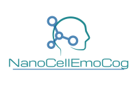

&NewLine;
&NewLine;

***

  {width=40%}

&NewLine;

***
**Project full title:** Neuroimmune aspects of mood, anxiety and
cognitive effects of leads/drug candidates acting at
GABAA and/or $\sigma2$ receptors: In vitro/in vivo
delineation by nano- and hiPSC-based platforms

&NewLine;

**Acronym:** NanoCellEmoCog

The main objective of the **NanoCellEmoCog** project is to test the hypothesis that nanocarrier-based pharmacokinetically optimized modulation of GABAA and $\sigma2$ receptors, on their own or in combination, results in substantial improvements in neuroimmune and/or behavioral outputs assessed in *in vitro* and *in vivo* systems made to mimic a compromised neuroimmune status, which has been recognized as a commonality underlying and unifying various CNS disorders characterized by mood, anxiety, and cognitive disturbances.

&NewLine;
&NewLine;
&NewLine;

**Funding:** The project is funded by the Science Fund of the Republic of Serbia, through the call IDEAS. The project is realised at the University of Belgrade-Faculty of Pharmacy. 

***

 &nbsp; &nbsp; &nbsp; 
 &nbsp; &nbsp; &nbsp; 
 

