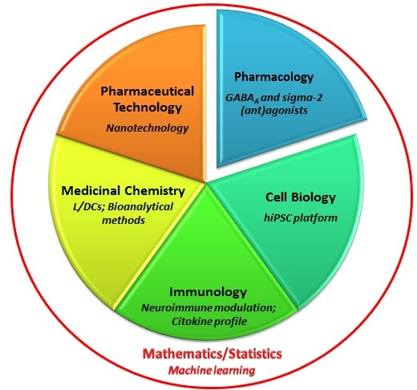

***
All researchers are part of the same scientific research organization - the Faculty of Pharmacy, University of Belgrade. The research team of the NanoCellEmoCog project consists of 14 highly motivated researchers, of different professions, experiences and competencies: 5 researchers from the Department of Pharmacology, 6 researchers from the Department of Pharmaceutical Technology and Cosmetology, 2 researchers from the Department of Microbiology and Immunology, and 1 researcher from each Department of Organic Chemistry and Department of Physics and Mathematics. 
<table border="0">
 <tr>
    <td><b style="font-size:30px"> </b></td>
    <td><b style="font-size:30px"> </b></td>
 </tr>
 <tr>
    <td>
     
      - [Miroslav Savić, PhD](http://pharmacy.bg.ac.rs/o-fakultetu/redovni-profesori/1690/dr-sc-miroslav-savi%C4%87/) - Principal Investigator  
      - [Snežana Savić, PhD](http://pharmacy.bg.ac.rs/o-fakultetu/redovni-profesori/651/dr-sc-sne%C5%BEana-savi%C4%87/)  
      - [Biljana Bufan, PhD](http://pharmacy.bg.ac.rs/o-fakultetu/vanredni-profesori/286/dr-sc-biljana-bufan/)  
      - [Ivan Jančić, PhD](http://pharmacy.bg.ac.rs/o-fakultetu/docenti/771/dr-sc-ivan-jan%C4%8Di%C4%87/)  
      - [Ivana Pantelić, PhD](http://pharmacy.bg.ac.rs/o-fakultetu/vanredni-profesori/1251/dr-sc-ivana-panteli%C4%87/)  
      - [Branka Divović Matović](http://pharmacy.bg.ac.rs/o-fakultetu/asistenti/2698/mag-farm-branka-divovi%C4%87-matovi%C4%87/)  
      - [Miloš Jovanović](http://pharmacy.bg.ac.rs/o-fakultetu/asistenti/4896/dr-sc-milo%C5%A1-jovanovi%C4%87-/)  
      - [Aleksandra Kovačević](http://pharmacy.bg.ac.rs/o-fakultetu/asistenti/4705/mag-farm-aleksandra-kova%C4%8Devi%C4%87/)  
      - Jovana Aranđelović, PhD  
      - [Tanja Ilić, PhD](http://pharmacy.bg.ac.rs/o-fakultetu/asistenti/4113/dipl-farm-tanja-ili%C4%87/)  
      - [Ines Nikolić, PhD](http://pharmacy.bg.ac.rs/o-fakultetu/asistenti/4111/mag-farm-ines-nikoli%C4%87/)  
      - [Danijela Milenković](http://pharmacy.bg.ac.rs/o-fakultetu/asistenti/2701/danijela-milenkovi%C4%87/)  
      - [Jelena Mitrović](http://pharmacy.bg.ac.rs/o-fakultetu/asistenti/5713/mag-farm-jelena-mitrovi%C4%87/)  
      - [Jelena Đoković](http://pharmacy.bg.ac.rs/o-fakultetu/asistenti/2916/mag-farm-jelena-%C4%91okovi%C4%87/)  
    </td>
    <td align="right">{width=70%}</td>
 </tr>
</table>

